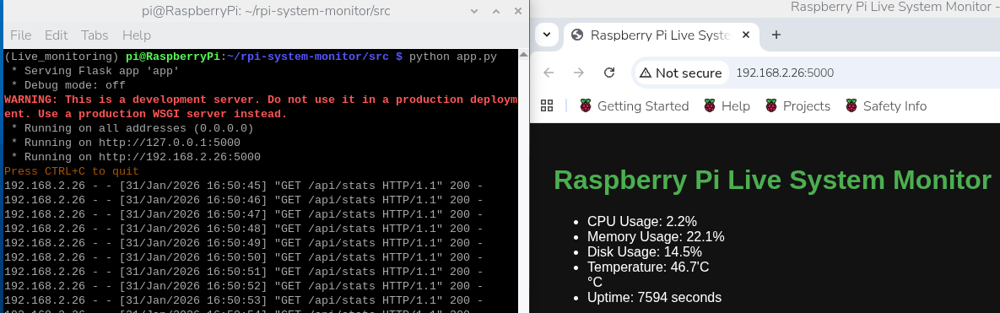

# Raspberry Pi Live System Monitor

# Dashboard Preview




A lightweight, real-time system monitoring dashboard built with **Python (Flask)** for **Raspberry Pi**. This project exposes live system metrics via a REST API and visualizes them in a clean web dashboard.

Designed to demonstrate practical **systems programming**, **backend APIs**, and **real-time monitoring** skills suitable for a **Junior Software / Embedded / DevOps Engineer** portfolio.

---

## Features

*  **Live monitoring** of CPU usage, memory usage, disk usage, and temperature
*  **Real-time updates** via periodic JSON polling
*  **Web-based dashboard** (HTML/CSS)
* Clean separation between **system logic** and **web layer**
* Runs efficiently on **Raspberry Pi** hardware

---

## Tech Stack

* **Python 3**
* **Flask** (REST API & web server)
* **HTML / CSS / JavaScript** (frontend dashboard)
* **Linux system interfaces**
* **Raspberry Pi OS**

---

## Project Structure

```text
rpi-system-monitor/
├── src/
│   ├── app.py                 # Flask application & routes
│   ├── system_info.py         # System metric collection logic
│   ├── cli.py                 # Optional CLI utilities
│   ├── templates/
│   │   └── dashboard.html     # Web dashboard UI
│   └── static/
│       └── style.css          # Dashboard styling
├── requirements.txt           # Python dependencies
├── README.md                  # Project documentation
└── .gitignore                 # Ignored files
```

---

## ⚙️ Installation & Setup

### 1️⃣ Clone the Repository

```bash
git clone https://github.com/quitecomplier-cxn/rpi-system-monitor.git
cd rpi-system-monitor
```

### 2️⃣ Create & Activate Virtual Environment

```bash
python3 -m venv Live_monitoring
source Live_monitoring/bin/activate
```

### 3️⃣ Install Dependencies

```bash
pip install -r requirements.txt
```

---

## Running the Application

```bash
cd src
python app.py
```

The server will start on:

* `http://127.0.0.1:5000`
* `http://<raspberry-pi-ip>:5000`

---

## API Endpoints

| Method | Endpoint | Description                |
| ------ | -------- | -------------------------- |
| GET    | `/`      | Dashboard UI               |
| GET    | `/stats` | Live system metrics (JSON) |

### Example JSON Response

```json
{
  "cpu_usage": 12.5,
  "memory_usage": 43.2,
  "disk_usage": 61.8,
  "temperature": "44.8°C"
}
```

---

##  Real-World Applications

This system monitoring dashboard has practical applications in real production environments:

### Embedded & IoT Systems

* Monitor Raspberry Pi–based embedded systems deployed in the field
* Detect overheating or resource exhaustion early
* Useful for kiosks, sensors, and edge computing devices

### Home & Small Office Servers

* Monitor self-hosted services (NAS, media servers, automation hubs)
* Lightweight alternative to enterprise monitoring tools

### Industrial & Lab Environments

* Monitor Raspberry Pi controllers in labs or automation setups
* Prevent hardware failures through continuous monitoring

### Education & Learning

* Demonstrates system programming, REST APIs, and dashboards
* Suitable for computer science and engineering coursework

### DevOps & System Administration

* Foundation for custom monitoring tools
* Helps understand how platforms like Prometheus or Nagios work internally

---

## Security & Performance Considerations

* Runs locally by default (no public exposure)
* Minimal resource footprint for constrained hardware
* Can be extended with authentication and HTTPS

---

## Future Improvements

*  Alerting (email / Slack) on threshold breaches
*  Historical data & graphs
*  Authentication and access control
*  Docker support
*  Remote monitoring & cloud deployment

---

## What This Project Demonstrates

* Linux system metric collection
* REST API design
* Flask backend development
* Real-time frontend updates
* Clean project organization
* Raspberry Pi hardware awareness

This project was designed with **production-readiness and extensibility** in mind.

---

## License

License — free to use, modify, and distribute.

---

## Author

**Charles Norgbe**
Electronic / Systems Engineer
GitHub: [https://github.com/quitecomplier-cxn](https://github.com/quitecomplier-cxn)

---

⭐ If you find this project useful, feel free to star the repository!
